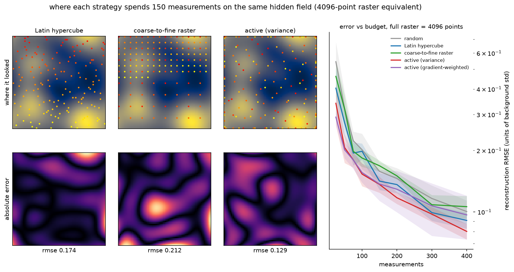

# active-learning-microscopy

**Question: when does an autonomous microscope that decides where to measure
next actually beat a well-designed dumb scan, and when does it lose?**

Microscopists burn most of a session's dose and time rastering regions that
contain nothing. The promise of autonomous experimentation is that a
surrogate model can steer the probe to informative positions and reach the
same map, or find the same defects, with a fraction of the measurements. The
promise is usually demonstrated against the weakest baseline, the full
raster. This repository is a simulation study that asks the harder question:
active learning versus a competent space-filling design, on equal terms,
with exact ground truth, including the regimes where active learning fails.

Everything is synthetic and physically motivated: a smooth property field
(composition, thickness, strain) with a known correlation length, optional
sharp grain boundaries, rare Gaussian defects, and constant-variance
Gaussian measurement noise, the high-count limit of shot noise when the
property contrast is small next to the mean detected signal. Synthetic data is the point,
not a compromise: it is the only way to score every strategy against exact
ground truth over hundreds of controlled runs. Nothing here is fit to, or
validated on, experimental data; the scope section says what that excludes.



The animated version, an active run choosing where to look while its
uncertainty map collapses: [figures/acquisition.gif](figures/acquisition.gif)

## Findings

Full tables with seeds and spreads are in [RESULTS.md](RESULTS.md); raw
numbers in `results/*.json`; all regenerate from fixed-seed configs. The
benchmark grid is 64 x 64, so a full raster is 4096 measurements.

**1. Active learning reaches map accuracy with about 21 percent fewer
measurements than Latin hypercube, and 43 percent fewer than a
coarse-to-fine raster.** Reaching RMSE 0.15 (in background-std units, noise
0.3) takes 114 measurements for GP-variance-driven sampling versus 144 for
LHS and 199 for raster, 5 seeds. The margin over a good space-filling design
is real but modest, and it lives in the sparse regime (under about 4 percent
of the raster); by 150 measurements LHS is statistically close. The
order-of-magnitude savings that headline autonomous-microscopy papers exist
only relative to the raster habit.

**2. The advantage is not a scoring artifact.** At the claimed operating
point the same designs were re-scored through a reference-tuned GP and
through model-free cubic interpolation (`configs/fairness.yaml`). Active
placement wins under all three reconstructors, so the gap comes from where
it measured, not from scoring designs through the surrogate's own model
family.

**3. Uncertainty sampling without hyperparameter learning is just greedy
space-filling, and a wrong surrogate turns active learning into the worst
strategy in the comparison.** With the lengthscale pinned to its true value
the active design is statistically indistinguishable from LHS (0.154 vs
0.145), which is what theory predicts: with fixed hyperparameters the GP
variance ignores the measured values, so the design degenerates to greedy
space-filling. With a 5x-too-long lengthscale it is 31 percent
worse than LHS with a 3x larger seed spread. High measurement noise is a
second measured failure regime: at noise 1.6 active sampling is 46 percent
worse than LHS, because the online hyperparameter fit destabilises exactly
when the data gets hard.

**4. For finding rare defects, active hunting is the only strategy that
reliably finishes, but a coarse-to-fine raster is embarrassingly strong at
the right defect size.** The expected-exceedance hunt finds 40 of 40 defects
across seeds by 300 measurements and leads mid-budget; random and LHS still
miss one defect in seven or eight at 500. But the raster also finds 40 of
40, because its completed stride-4 pass covers 94 percent of possible
centres to within the 2.35 px core radius (a lattice guarantee only begins
at radius 2.83 px, defect sigma 2.4), so the tie is near-complete coverage
plus a favourable draw. The operating-point check
(`configs/size_sweep.yaml`) shows the parity is a coincidence of size
either way: shrink defects to sigma 1.5 px (61 percent coverage) and the
hunt finds 62.5 percent versus raster's 50; shrink to sigma 1.0 and every
method fails, because there is no longer any signal for intelligence to
exploit.

**5. On non-stationary grain structures, gradient-weighted acquisition helps
modestly and consistently** (RMSE 0.380 vs 0.428 for LHS at 200
measurements), by steering measurements to boundaries. No strategy does well
there: a stationary kernel cannot serve domain interiors and sharp edges at
once, and the honest summary is incremental improvement, not rescue.

## Method

- **Scenes** (`activescan.sim`): stationary Gaussian random fields
  (spectrally filtered white noise, unit std, correlation length in px), or
  Voronoi grain fields with sharp boundaries; rare defects as narrow
  Gaussian bumps with exact recorded centres; measurements return field
  value plus Gaussian noise. Exact ground truth throughout.
- **Surrogate** (`activescan.gp`): exact GP regression from scratch (RBF or
  Matern-3/2, Cholesky solves, marginal-likelihood fitting with L-BFGS-B).
  Sequential runs update the posterior over all 4096 candidates with exact
  rank-one updates, unit-tested against the batch posterior at 1e-10, so a
  400-step active run takes seconds. See
  [docs/surrogate_card.md](docs/surrogate_card.md) for the full
  specification and measured failure modes; there is deliberately no trained
  model artifact, because the surrogate refits online inside every run.
- **Strategies** (`activescan.strategies`): random, Latin hypercube, and
  coarse-to-fine raster baselines; active variance, gradient-weighted
  variance, and expected-exceedance defect hunting with a found-and-move-on
  exclusion. No strategy ever reads the ground truth.
- **Scoring** (`activescan.metrics`): true RMSE against ground truth through
  one shared reconstructor; defects count as found only when a measurement
  lands inside the half-amplitude core, with no tunable detector threshold.
- **Benchmarks** (`activescan.benchmark`): eight fixed-seed YAML configs
  covering budget curves, noise, defect sparsity and size, misspecification,
  and reconstructor fairness.

## Install

Python 3.11. NumPy, SciPy, Matplotlib, PyYAML; no deep-learning stack.

```
python -m venv .venv
.venv\Scripts\activate          # Windows; source .venv/bin/activate elsewhere
pip install -e ".[dev]"
```

## Quickstart

```
activescan demo                                        # all strategies on the committed sample
activescan simulate --grid 64 --defects 8 --seed 7 --out scene.npz --figure scene.png
activescan run scene.npz --strategy active_variance --budget 200 --figure run.png --gif run.gif
activescan run scene.npz --strategy active_hunt --budget 300
activescan benchmark configs/reconstruction.yaml       # any committed benchmark
python scripts/run_all.py                              # every benchmark + metrics + figures, ~10 min
```

The tutorial notebook (`notebooks/tutorial.ipynb`, committed executed) walks
from simulation through the surrogate, the active loop, the strategy
comparison, defect hunting, and both honest checks, with a figure at every
step. The Python API is documented with runnable examples in
[docs/api.md](docs/api.md).

## Bring your own data

No experimental map is committed: openly licensed scanning-microscopy
property maps with clear provenance are rare, so rather than ship something
licence-ambiguous, `activescan.io.load_external` wraps any fully acquired 2D
map of yours as a replayable scene. The map acts as the measurement oracle,
answering the practical question of how many measurements of your own sample
a strategy would have needed:

```
activescan replay my_map.npy --strategy active_variance --budget 300 --figure replay.png
```

[data/README.md](data/README.md) documents the format, conversion from
vendor files via HyperSpy, and the caveats.

## Repository layout

```
src/activescan/     sim, gp, strategies, reconstruct, metrics, benchmark, plots, io, cli
configs/            eight fixed-seed YAML benchmark configs
data/sample/        one committed synthetic scene with exact ground truth (33 KB)
notebooks/          executed tutorial notebook
docs/               API documentation + surrogate card
figures/, results/  regenerable outputs of the committed configs
scripts/            run_all, make_metrics, make_figures, build_notebook
tests/              72 pytest tests
```

## Scope and limitations

- Everything is simulated, and simple on purpose: Gaussian fields, Gaussian
  bumps, homoscedastic Gaussian noise, a single isotropic correlation
  length. Real instruments add drift, dose-dependent and correlated noise,
  detector artifacts, and re-visit costs that are all absent here. The
  numbers measure method behaviour inside this model; none of them transfer
  to any instrument as-is.
- Measurement cost is uniform and probe movement is free, so the benchmark
  optimises the number of measurements, not scan-path length or dwell
  scheduling.
- Each position can be measured once; repeat-measurement averaging, which
  matters in the high-noise regime, is out of scope (and the high-noise
  failure of active sampling is reported, not hidden).
- The defect hunt assumes positive-going anomalies against a robust
  threshold. Bipolar or texture-type defects need a different acquisition.
- The GP is exact, so the approach as implemented scales to grids of tens of
  thousands of candidates, not millions; sparse or inducing-point surrogates
  are out of scope.

## Author

Aamir Malik

- GitHub: https://github.com/aamirmalik-dr
- LinkedIn: https://linkedin.com/in/dr-aamirmalik

## License

MIT for all code and all committed synthetic data. See [LICENSE](LICENSE).
